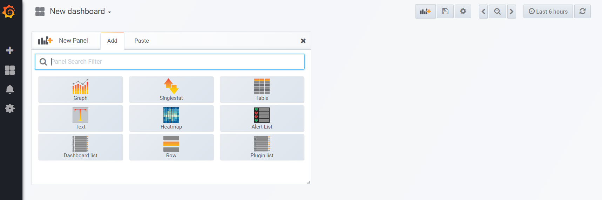
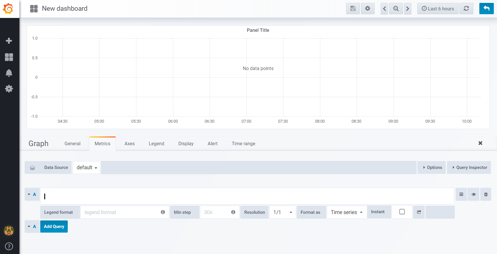
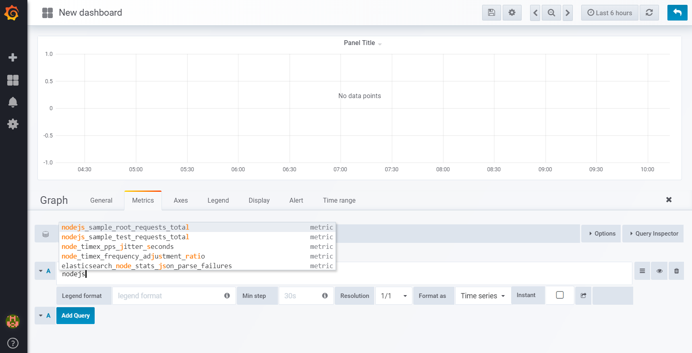
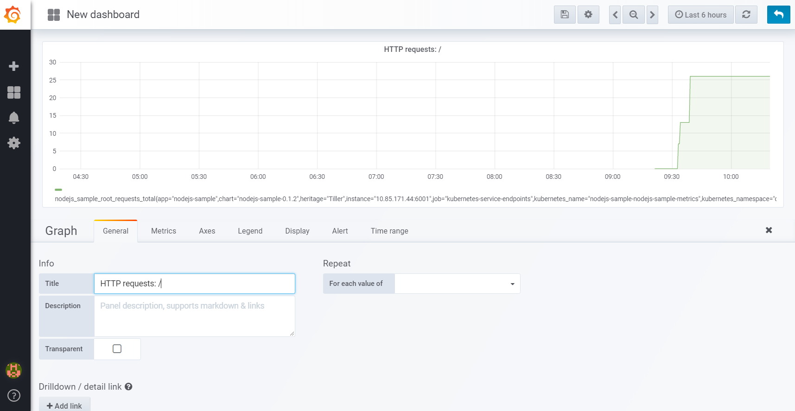
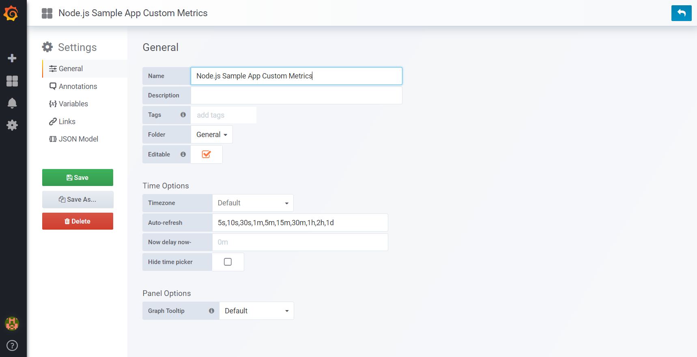
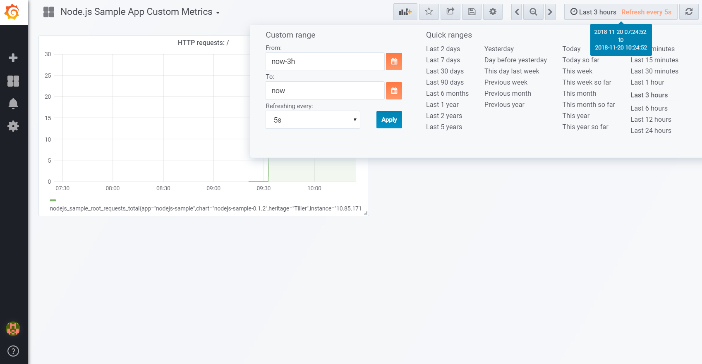
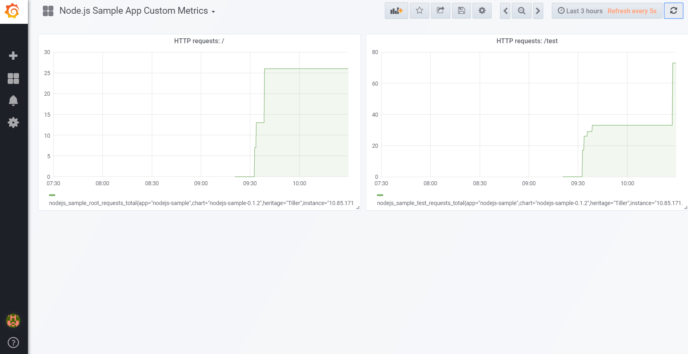

= Node.js sample application
:toc:

Node.js sample application. Developed to be used with OpenShift and other Kubernetes platforms, but can be used without Kubernetes.

== Local

* Build:
** `docker build -t nodejssample .`
* Run in foreground:
** `docker run -it --rm --name nodejssample run -p 6001:6001 nodejssample`
* Run in background:
** `docker run -d --name nodejssample -p 6001:6001 nodejssample`

== OpenShift

One way to deploy this app to OpenShift is described here. We are going to use OCP feature, the Docker build, to build container images from source. 

But why not S2I? IMHO, I have more control and I know exactly what is running in my local development environment and in the server when I use my own container image. I can also deploy the same image to other Kubernetes/Docker environments easily.

* Login to OCP and create a new project.
* Create new app:
** `oc new-app https://github.com/samisalkosuo/nodejs-sample -l app=nodejs-sample`
** _-l app=nodejs-sample_ adds label to deployment.
** If using option _--name mynodeapp_, it would set name for the generated resources.
* Watch pod status: `watch -n3 oc get pods`
* Soon pod _nodejs-sample-1_ is running.
* Creating new-app created also service:
** `oc describe svc nodejs-sample`
* But route is not created automatically. So let's create it:
** `oc expose svc nodejs-sample`
* Check the route URL:
** `oc get route`
* Go to that route URL.
* Delete application, if not needed anymore:
** `oc delete all -l app=nodejs-sample`
** Deletes all resources that have the specified label.

=== Secure route

The default OCP route is unsecured and does not accept TLS. This is the case at the time of writing and OCP version 4.3.19.

* https://docs.openshift.com/container-platform/4.3/networking/routes/secured-routes.html[OCP documentation] shows how to add custom certificate and use either edge or reencrypt.
* Or you can use existing ingress certificate by patching route to set termination to edge and redirect if using plain http:
** `oc patch route nodejs-sample -p '{"spec":{"tls":{"insecureEdgeTerminationPolicy":"Redirect","termination":"edge"}}}'`

=== Application as a container image

In some cases, we may get the application as a container image. For example: _nodejssample.tar.gz_.

* Load image locally:
** `docker load < nodejssample.tar.gz`
* Login to private image registry, tag and push nodejssample image there.
** As an example, let's say that image in private registry is: _registry.private.net:5000/nodejssample:0.1_.
* Login to OCP and create a new project.
* Create new app and specify docker image:
** `oc new-app --docker-image=registry.private.net:5000/nodejssample:0.1 -l app=mynodeapp --name mynodeapp -e APP_NAME=mynodepp`
** Option `--name mynodeapp` sets the name for the resources.
** Option `-e APP_NAME=mynodepp` sets environment variable for the container.
** Note: OpenShift must be able to pull images from the private registry, see https://docs.openshift.com/container-platform/4.3/openshift_images/managing_images/using-image-pull-secrets.html#images-update-global-pull-secret_using-image-pull-secrets[Using image pull secrets].

=== Deployment config

OpenShift creates resource _deploymentconfig_ or _dc_ when new application is created. This _deploymentconfig_ can be updated and it would trigger new application pod to be deployed.

=== Multiple images

In some cases, application includes multiple images. 

See link:./multi/README.adoc[README in the multi-directory].

== Old days

In the old days, the other Kubernetes platform was IBM Cloud Private.

== ICP monitoring

ICP includes monitoring service based on Prometheus and Grafana. Applications can use existing monitoring.

Prometheus includes a lot of [client libraries](https://prometheus.io/docs/instrumenting/clientlibs/) that could be used. The purpose of this application is to implement custom metrics and no existing libraries are used.

This app has /metrics endpoint to show custom metrics. 

See link:./src/app.js[app.js] for example of two metrics:

* total requests to / 
* total requests to /test

https://www.ibm.com/support/knowledgecenter/SSBS6K_3.1.0/featured_applications/deploy_monitoring.html[ICP documentation] describes the monitoring service. In order to use application custom metrics, /metrics endpoint must be implemented and endpoint must return metrics data.

Metrics data must be formatted so that Prometheus understands:

- Metrics label naming: https://prometheus.io/docs/practices/naming/
- Metrics data format: https://prometheus.io/docs/instrumenting/exposition_formats/
- See link:./src/app.js[app.js] /metrics endpoint as an example of custom metrics.
- Metrics service must be added. See metrics-service of the application, See branch jenkins and file _service.yaml_.

=== Using custom metrics

After application is deployed and if it has metrics service, ICP includes application metrics endpoint to Prometheus as a target. 

All Prometheus targets are shown in the Prometheus UI: "https://<ICP_MASTER_IP>:8443/prometheus/targets".

Grafana is used as monitoring UI: "https://<ICP_MASTER_IP>:8443/grafana/".

Steps to create custom dashboard to show application custom metrics:

* Create new dashboard and add Graph-panel.

* New dashboard is created. Use drop down next to "Panel title" and select "Edit".

* Select data source "Prometheus".
* Enter "nodejs" to text field and you see the two custom metrics.

* Select "nodejs_sample_root_requests_total"
* Select "General" tab and change panel name to: "HTTP requests: /".

* In the dashboard settings, change the dashboard name to: "Node.js Sample App Custom Metrics".

* Click time selector (for example: "Last 6 hours") and change range and add refresh interval:

* Add another panel for "HTTP requests: /test".
* Save dashboard.
* Open sample application many times using URLs: / and /test.
* You see custom metrics in Grafana dashboard:

